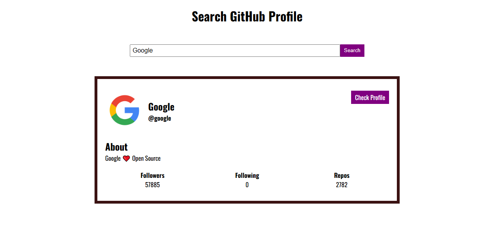

# 🛍️ Product Search Filter

 

A clean and responsive web app that allows users to search and filter products using a public API. Ideal for practicing API handling, search functionality, and dynamic DOM manipulation.

 

## 🚀 Features

- Search products by name  
- View product image, title, description, and price  
- Real-time filtering as you type  
- Responsive layout for all screen sizes  
- Clean and modern UI

 

## 🧰 Built With

- HTML  
- CSS  
- JavaScript  
- Public Product API (e.g. DummyJSON or FakeStore API)

 

## 📷 Screenshot

 

## 📄 License

This project is licensed under the MIT License – see the [LICENSE](LICENSE) file for details.
